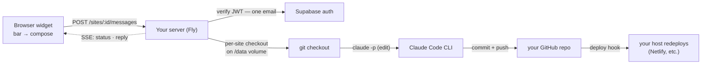

# Agent Keyboard

> A prompt bar that edits the site it's on.

[](./LICENSE)


One `<script>` tag turns a static site into something you change by asking. The owner taps the bar,
signs in, and describes a change — typed, dictated, or photographed. A real **Claude Code** session
edits that site's own git repo, commits as `Agent Keyboard`, and pushes to `main`; wherever you
deploy from redeploys. Every step streams live, and the job is fire-and-forget — close the tab and
it keeps running server-side; reopen and the bar re-attaches.

```html
<!-- one line, before </body>, on any page you own -->
<script src="https://YOUR-APP.fly.dev/widget.js" data-site="mysite" defer></script>
```

`data-site` is the id of a repo in your allow-list (the `SITES` env var). The API defaults to wherever
the script is served from.

**[agentkeyboard.com](https://agentkeyboard.com) runs this widget on itself** (`data-site="halo"`) —
the marketing site edits its own repo. When you see a commit here authored by `Agent Keyboard`, it was
made from the bar at the bottom of that page.

<p align="center">
  
</p>
<p align="center">
  <sub>A real session, recorded live — the commit it lands (<code>c4f6277</code>) is in this repo's history.</sub>
</p>

<p align="center">
  
</p>
<p align="center">
  <sub>The expanded transcript of another real exchange.</sub>
</p>

| Sign in — a prompt, not a form | A job running | At rest |
|---|---|---|
|  |  |  |

## What this is

A personal tool, open-sourced because there's no reason to keep it closed. It scratches one itch: I
own a handful of small static sites, I already pay for Claude Code, and I wanted to fix a typo or
tweak a section from my phone without opening an editor. So it's narrow on purpose — an allow-list of
accounts (you, maybe a client or a partner), an allow-list of repos you control, no public signups,
no dashboard. If you have a Claude Code subscription and
static sites you deploy from git, you can fork it and point it at your own repos in under an hour (see
[SELF_HOSTING.md](./SELF_HOSTING.md)). If you don't, it probably isn't for you.

## How it works



The widget is a Shadow-DOM-isolated bundle baked into the server image and served at `/widget.js`. The
server is Express on Fly.io. Auth is a Supabase JWT that must belong to your one allowed email. Each
site is a durable git checkout on a Fly volume (`HOME=/data`), so the Claude Code session — its memory
and compaction — persists between runs. The CLI runs headless (`claude -p`) with permissions bypassed
inside the VM, edits the checkout, commits, and pushes with a repo-scoped token.

## Self-host quickstart

Full walkthrough with time estimates in **[SELF_HOSTING.md](./SELF_HOSTING.md)**.

**You'll need accounts with:**

- [GitHub](https://github.com) — holds your site repos and issues the push token. (You have this.)
- A [Claude](https://claude.ai) **Pro or Max** subscription — `claude setup-token` mints the OAuth token the server's CLI edits with. This is the one cost that matters.
- [Supabase](https://supabase.com) — auth (your one login) plus optional job history. Free tier is fine.
- [Fly.io](https://fly.io) — runs the server. The guide prescribes Fly; a Dockerfile exists if you insist on hosting elsewhere.
- A static-site host you already use — [Netlify](https://netlify.com), [GitHub Pages](https://pages.github.com), [Cloudflare Pages](https://pages.cloudflare.com), etc. Anything that redeploys your repo on push. **This project does not host your site.**

**What it costs.** Your existing Claude subscription does the editing, plus one small always-on Fly VM
— usage-billed, on the order of a few dollars a month. It stays running on purpose so detached jobs
survive after you close the tab. Supabase's free tier covers auth and job history. If you'd rather pay
less, you can let the Fly machine sleep and wake on request, trading away the fire-and-forget
guarantee — see the cost note in [SELF_HOSTING.md](./SELF_HOSTING.md).

**The short version:**

1. **Supabase** — create a free project, turn *off* new signups, add one user (your login), run
   [`server/sql/jobs.sql`](./server/sql/jobs.sql). Copy the URL, anon key, and service_role key.
2. **GitHub PAT** — a fine-grained token scoped to *only* the repos you'll edit: Contents read/write +
   Metadata, and deliberately **no** workflows permission.
3. **Claude token** — `claude setup-token` (needs a Claude Pro or Max subscription).
4. **Fly** — `fly launch` from the repo root with `--config server/fly.toml`, rename the app, create
   the `agent_data` volume, set your secrets, deploy.
5. **CI (optional)** — add `FLY_API_TOKEN` as a repo secret to autodeploy on push.
6. **Embed** — drop the `<script>` tag on your site; `data-site` must match a `SITES` id and the page's
   domain must equal that site's `domain`.

## Configuration

Set on the server (Fly secrets for anything sensitive). The server **exits at boot** with a message
listing any missing *required* var.

**Required**

| Var | What it is |
|-----|-----------|
| `SUPABASE_URL` | Supabase project base URL. Also injected into the served widget bundle. |
| `SUPABASE_ANON_KEY` | Publishable anon key. Public by design; injected into the widget. |
| `ALLOWED_EMAIL` | The email(s) allowed to drive the agent — one, or a comma-separated few (case-insensitive). |
| `SITES` | One-line JSON array allow-list of repos the agent may edit (see below). |
| `GH_TOKEN` | Fine-grained PAT: only the `SITES` repos, Contents read/write + Metadata, no workflows. |

**Optional**

| Var | What it is |
|-----|-----------|
| `CLAUDE_CODE_OAUTH_TOKEN` | Read by the Claude Code CLI, never by server code; from `claude setup-token`. Boot warns if missing — the agent can't run without it. |
| `ALLOWED_USER_ID` | Extra pin to specific Supabase user UUID(s), comma-separated. |
| `SUPABASE_SERVICE_KEY` | Enables durable job history / re-attach. Works without it; boot warns. |
| `OPENAI_API_KEY` | Voice dictation (ephemeral realtime tokens minted server-side). Absent = the mic button errors with "voice not configured". |
| `EXTRA_ORIGINS` | Comma-separated extra CORS origins (deploy previews, staging). |
| `CLAUDE_MODEL` | Model for the CLI. Default `opus`. |
| `CLAUDE_RUN_TIMEOUT_MS` | Per-run timeout. Default `900000`. |
| `CLAUDE_BIN` | Path to the `claude` binary. Default `claude`. |
| `AGENT_DATA_DIR` | Checkout + session root. Default `/data`. |
| `WIDGET_JS_PATH` | Override path to the built `widget.js`. |
| `PORT` | Default `8080`. |
| `GIT_AUTHOR_NAME` / `GIT_AUTHOR_EMAIL` | Commit identity. Default `Agent Keyboard` / `agent@agentkeyboard.com`. |
| `GIT_COMMITTER_NAME` / `GIT_COMMITTER_EMAIL` | Same defaults. |
| `REALTIME_TRANSCRIBE_MODEL` | Default `gpt-4o-transcribe`. |
| `REALTIME_FALLBACK` | Set `1` to use the fallback realtime session shape. |

Copy [`server/.env.example`](./server/.env.example) to `server/.env` for local dev.

**The `SITES` allow-list.** A one-line JSON array; each entry maps a slug to a repo, a branch, and a
domain:

```
SITES=[{"id":"blog","repo":"https://github.com/you/blog.git","branch":"main","domain":"blog.example.com"}]
```

- `id` — the slug you put in the embed tag's `data-site`.
- `repo` — https clone URL; the `GH_TOKEN` is injected at clone/sync time.
- `branch` — the branch your host deploys from.
- `domain` — bare host (no scheme). Drives CORS (`https://domain` and `https://www.domain` are
  auto-allowed) and the `[Sent from …]` context handed to the agent.
- `pushBranch` *(optional)* — publish the agent's commit to this branch instead of pushing straight to
  `branch`. Use it when you'd rather review changes than deploy them live: nothing redeploys until you
  merge the branch yourself. A `{ts}` placeholder becomes a UTC timestamp, so `"agent-keyboard/{ts}"`
  gives each change its own branch. Must differ from `branch`. See [SELF_HOSTING.md](./SELF_HOSTING.md#a-review-step-instead-of-straight-to-main).

A pretty-printed multi-site example lives in [`server/sites.example.json`](./server/sites.example.json).

## Security model

Concentric rings, honestly stated:

1. **Allow-list gate.** Every request must carry a Supabase JWT that resolves to an email on your
   `ALLOWED_EMAIL` list (optionally pinned further to `ALLOWED_USER_ID`). No accounts exist beyond
   the ones you created by hand.
2. **The `SITES` allow-list.** The agent can only ever touch repos you listed. A request for any other
   site id is rejected; there is no "edit an arbitrary repo" path.
3. **Bounded blast radius.** The CLI runs with permissions bypassed, but *inside a dedicated Fly VM*.
   The most it can reach is the `/data` volume and whatever `GH_TOKEN` can — which is why the PAT is
   repo-scoped, contents-only, and has no workflows permission (GitHub then rejects any push that
   touches `.github/workflows/`, capping what the agent can change).
4. **No key reaches the browser.** The anon key is public by design (RLS gates everything). Voice uses
   short-lived OpenAI tokens minted server-side. The Claude, GitHub, and Supabase service keys live
   only in Fly secrets.

One thing to know: **your prompts become commit messages.** If a target repo is public, what you typed
is visible in its history.

**Full threat model:** [SECURITY.md](./SECURITY.md) — what an unauthenticated attacker can and can't
reach, where the trust boundaries sit, and the residual risks stated plainly.

## Develop

- **Widget** — `cd widget && npm i && npm run build` (→ `dist/widget.js`). `npm run mock` runs a
  zero-dep mock server plus a hostile host page under `dev/` for local testing. See
  [`widget/README.md`](./widget/README.md).
- **Server** — `cd server && npm i`, copy `.env.example` to `.env`, then `npm run dev` (watch mode).
- **Site** — static; open `site/index.html`.

## Repo layout

| Dir | What it is |
|-----|-----------|
| `site/` | The marketing site (agentkeyboard.com) and the original vision film. |
| `server/` | Express API + the Claude Code CLI runner; serves `/widget.js`, streams SSE. |
| `widget/` | The embeddable bundle: TypeScript, zero runtime deps, ~15 KB gzip, Shadow-DOM isolated. |

## License

MIT — see [LICENSE](./LICENSE).

Built by [@vibhasjain](https://github.com/vibhasjain) — with the bar itself, wherever possible.
